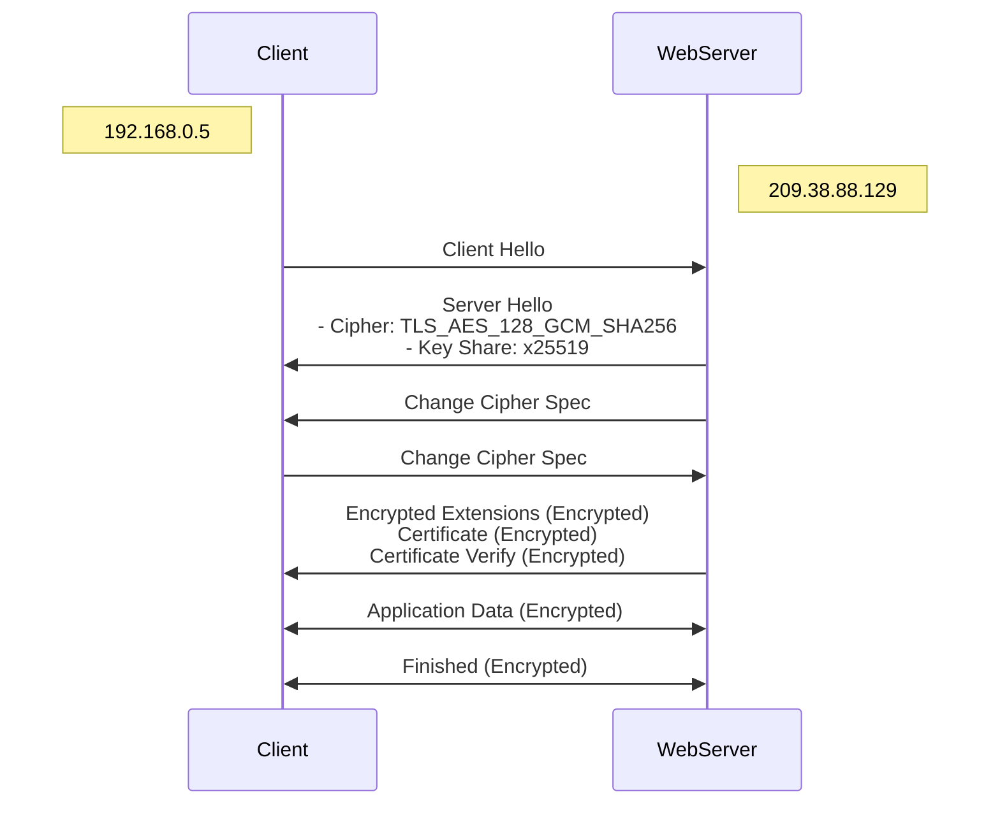

```mermaid
sequenceDiagram
participant Client
participant WebServer
Note left of Client: 192.168.0.5
Note right of WebServer: 209.38.88.129
Client->>WebServer: Client Hello
WebServer->>Client: Server Hello <br/> - Cipher: TLS_AES_128_GCM_SHA256 <br/> - Key Share: x25519 
WebServer->>Client: Change Cipher Spec
Client->>WebServer: Change Cipher Spec
WebServer->>Client: Encrypted Extensions (Encrypted) <br/> Certificate (Encrypted) <br/> Certificate Verify (Encrypted)
WebServer<<->>Client: Application Data (Encrypted)
Client<<->>WebServer: Finished (Encrypted)
```
